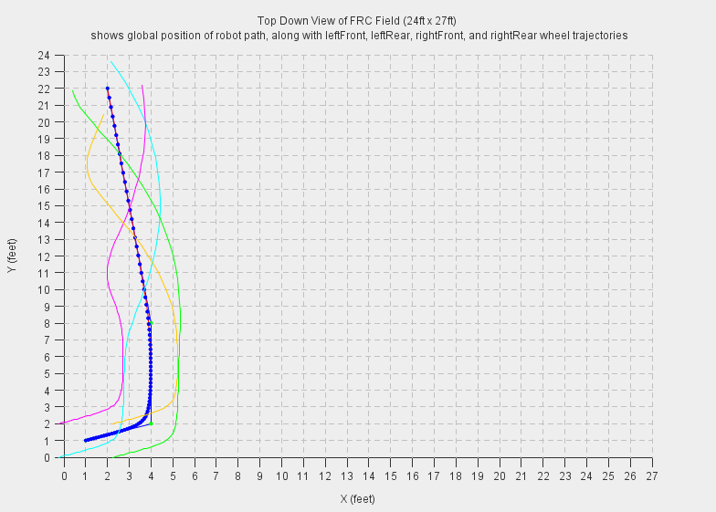
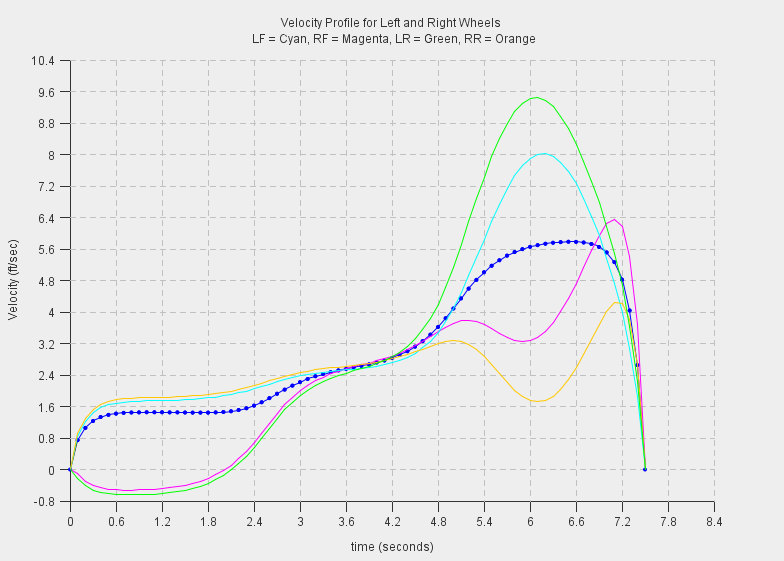
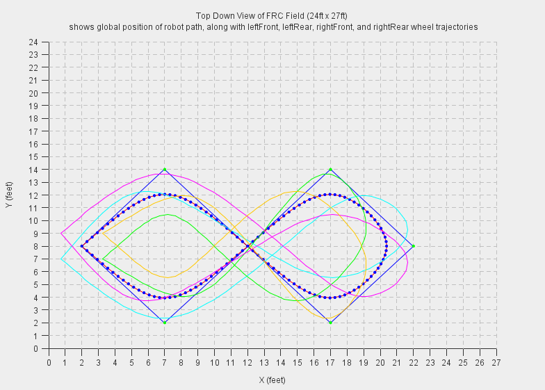
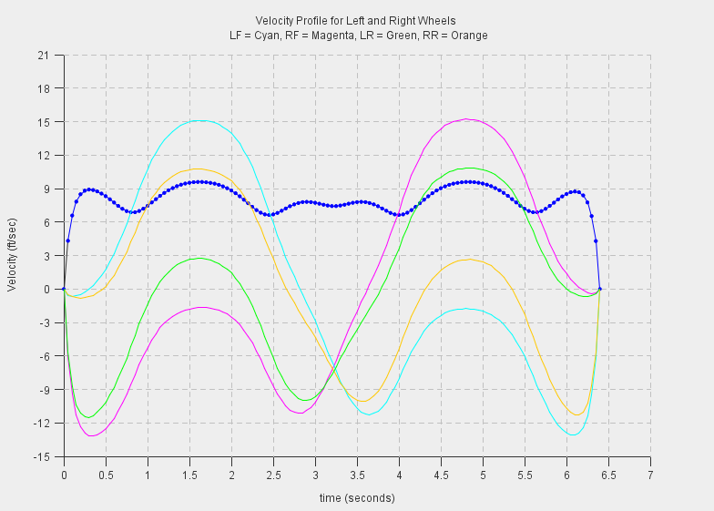

SmoothPathPlanner - MecanumPathPlanner
======================================

This is a fork of [KHEngineering's SmoothPathPlanner](https://github.com/KHEngineering/SmoothPathPlanner) (direct fork under our SmoothPathPlanner repo) modified to work with mecanum drivetrains.  Robot Casserole 1736 used the normal SmoothPathPlanner in our 2016 season with great results.  The updates provided in this repository allow for X/Y coordinates as well as a separate heading input for the waypoints.  If the robot heading stays fixed, the robot will strafe between waypoints where the X position is changed rather than rotate as it did in the original path planner.  The heading is continuous, meaning that if you wish to rotate more than a full rotation you will need to specify headings greater than 360 or less than 0.

The original readme (linked above) contains significantly more information on how to use the algorithm.  The main differences here are that a TrackLength must be input so that locations of all four wheels can be determined, and the heading must always be included with each coordinate pair in the waypoints array.  Below are two examples of how this algorithm can be used and the associated outputs.

This code defines the "velocity magnitude" as both magnitude and sign, allowing both positive and negative sign.  This allows the mecanum wheels to drive forward or reverse as necessary.  In the original path planner, the wheels never needed to go in reverse to achieve a smooth path.


Practical example that drives around a potential obstacle/robot that could be near the driver station wall and then ends pointed at the corner.

```java
		double[][] waypoints = new double[][]{
			{1, 1, 90},
			{4, 2, 90},
			{4, 8, 90},
			{2, 22, 315}
		};

		double totalTime = 8; //max seconds we want to drive the path
		double timeStep = 0.1; //period of control loop on Rio, seconds
		double robotTrackWidth = 2; //distance between left and right wheels, feet
		double robotTrackLength = 2.5; //distance between front and rear wheels, feet

		MecanumPathPlanner path = new MecanumPathPlanner(waypoints);
		path.calculate(totalTime, timeStep, robotTrackWidth, robotTrackLength);
```

After the `calculate` method is called, the smooth path, front left, rear left, front right, and rear right velocities are all calculated and stored into the class data members.

### Wheel paths for practial example


### Wheel velocities for practical example



A different example which really shows the abilities of this algorithm but is basically useless on the field is a figure 8 while doing one full rotation.  In this example, the timeStep must be decreased (or the totalTime increased) because a smooth path will fail to be generated using only 80 points.

```Java
		double[][] waypoints = new double[][]{
			{2, 8, 90},
			{7, 2, 135},
			{12, 8, 180},
			{17, 14, 225},
			{22, 8, 270},
			{17, 2, 315},
			{12, 8, 360},
			{7, 14, 405},
			{2, 8, 450}
		};

		double totalTime = 8; //max seconds we want to drive the path
		double timeStep = 0.05; //period of control loop on Rio, seconds
		double robotTrackWidth = 2; //distance between left and right wheels, feet
		double robotTrackLength = 2.5; //distance between front and rear wheels, feet

		MecanumPathPlanner path = new MecanumPathPlanner(waypoints);
		path.calculate(totalTime, timeStep, robotTrackWidth, robotTrackLength);
```

### Wheel paths for figure 8 example


### Wheel velocities for figure 8 example

